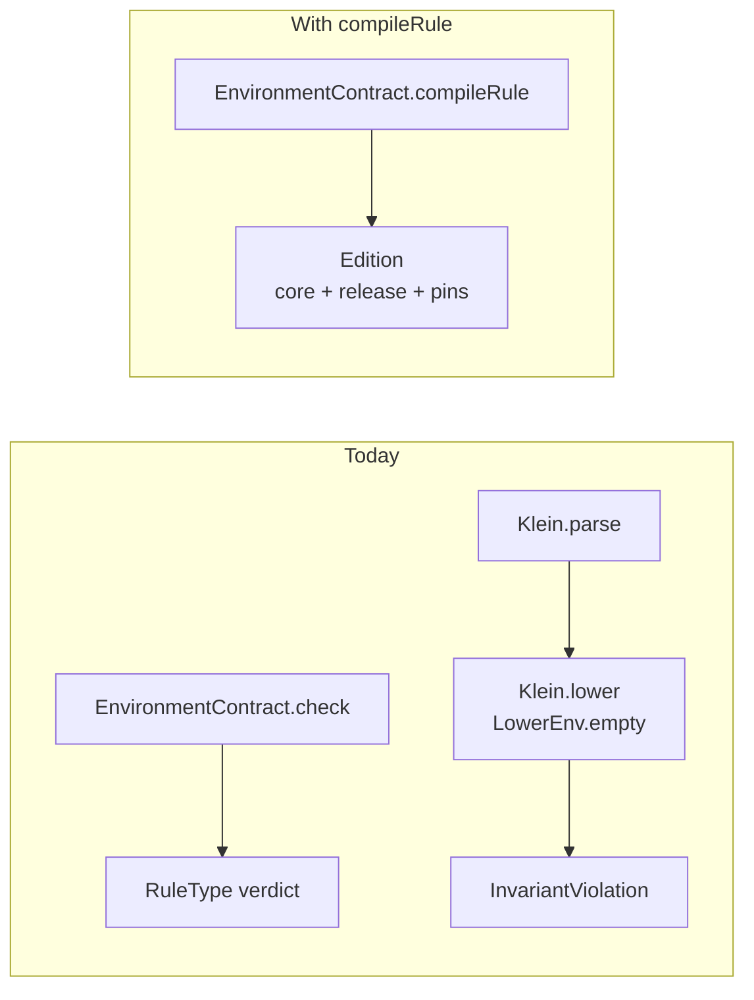
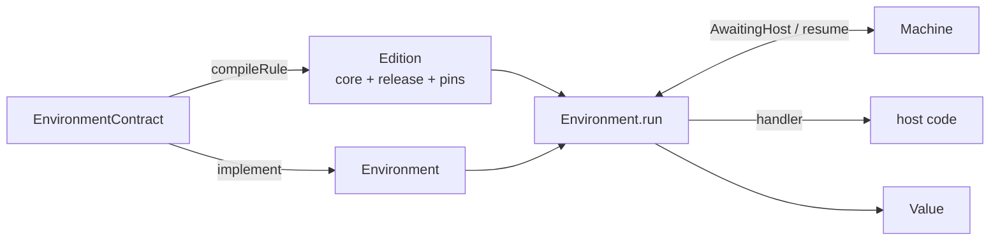

# Make Capabilities Callable From Rule Expressions

### System Design

#### The contract compiles rules, not just checks them

Today the contract side and the execution side never meet. `EnvironmentContract.check` projects a
release into a `RuleEnv` and hands back a verdict; the CLI then throws the rule source back at the
plain pipeline, which re-parses it and lowers it from `LowerEnv.empty` — with no idea the release
exists. A capability name that checked fine dies at `InvariantViolation("unbound name … at lowering")`
(Lowering.kt:155), which the CLI catches by hand to print "not callable yet".

We close the gap by giving `EnvironmentContract` a second verb beside `check`. Both inputs lowering
needs — the projected types and the name→revision surface — are already inside the contract
(the memoized `RuleEnv` per release, and the private `surfaces` map).

```kotlin
// klein/check/contract/EnvironmentContract.kt
fun check(ruleSource: String, release: ReleaseNumber): RuleType      // exists today
fun compileRule(ruleSource: String, release: ReleaseNumber): Edition // new

/** A rule version compiled against one release: Klein Core, plus the pins it resolved. */
class Edition(
    val core: CoreExpr,               // revision-free IR — a HostCall carries a plain name
    val release: ReleaseNumber,
    val pins: Map<String, Revision>,  // every contract name the rule used, at the revision it got
)
```

The artifact keeps the spec's word — `host-integration.md` §Edition defines an edition as exactly
this pair, and the downstream work that consumes it (edition serialization, reconciliation, drain)
already speaks that vocabulary. `check` remains the way to ask for a rule's type.

`compileRule` is throw-or-succeed like its neighbours (`checkContract`, `check`, `implement`):
holding an `Edition` means the rule checked *and* lowered. It parses once, so the CLI's current
double-parse disappears.



`Klein.lower(program)` stays as it is for contract-free programs; the contract path reaches lowering
through `compileRule`, which supplies the release vocabulary.

> **Extracted from this feature** — the result sink is now its own roadmap item
> ([host-integration-roadmap.md](../../host-integration-roadmap.md) §Result sink): it changes the
> contract language, so it goes spec-first, on its own. The next two sections and §"The sink
> decision is a branch on two facts" below are kept as its design draft; nothing in this feature
> implements them.

#### A release may nominate one capability as where the rule's answer goes

A rule's answer is its trailing expression. That works, but it can't express "decide early", and it
gives the host no way to state what a rule must produce. Both fall out if the answer travels through
an ordinary capability:

```
type Decision = Approve { limit: Num } | Decline
fun decide(d: Decision): Nothing

release 2
  Decision
  result decide
```

`result` is a contextual prefix on a release entry, the same shape `remove` already has
(Parser.kt:109-113), so which capability plays the role — and what it is called — is the contract
author's choice, per release. A host writes `decide`, `conclude`, `approve`, or `price` as its domain
prefers.

The sink's parameter type *is* the release's declared result type. A rule delivers through it one of
two ways, and never half of each:

```klein
# it never mentions decide: the trailing expression is wrapped for it
customer.tier == "gold" and creditScore(customer) >= 620
    ->  decide(customer.tier == "gold" and creditScore(customer) >= 620)

# or it concludes on every path itself, and nothing is added
if score < 500 then decide(Decline) else decide(Approve(limit))
```

Mixing the two — concluding in one branch and falling out with a value in another — is a compile
error, not a silent wrap. That is the whole point of the rule: an author who writes `decide` in one
place has the concept in mind, so leaving the other path implicit is far more likely a forgotten
conclusion than an intention, and no diagnostic can tell which if we accept it.

A rule that never concludes and whose trailing expression doesn't fit is the same error from the
other side: `this rule produces Bool; decide declares Decision`. The sink's parameter type is what
makes that check possible, and ordinary argument checking is what performs it.

Early exit needs no type-system work: `Nothing` is `TBottom`, already surface-writable
(`TypeResolver.kt:149`), already the bottom of `isSubtype` (Subtyping.kt:19), and `lub(TBottom, T)`
already returns `T` (Subtyping.kt:89) — so an `if` arm that concludes and one that carries on join
cleanly.

Three new contract checks come with the entry: a release surface may mark **at most one** result, the
marked name must be exposed by that release, and it must be a `fun` returning `Nothing` — which is
what makes an explicit early `decide(...)` and the implicit trailing wrap mean the same thing.

Releases that mark no result are unchanged: the trailing expression is the run's value, as it is for
contract-free `klein run` today.

#### A capability declared `Nothing` ends the run — a rule the runner enforces, not the machine

A call to a capability declared `: Nothing` suspends like any other, hands the host its argument, and
the run is **over**. Nothing in the machine or the IR knows this: the runner resolves every call to
its `Capability` anyway (it needs the declared type to shape-check answers), sees `Nothing`, and
simply never resumes — abandoning a suspension is legal, since one-shot semantics forbid using it
twice, not zero times. `Environment.run` answers with the value the rule concluded.

So `Core`, `Machine`, and `Execution` are untouched by this feature, and the terminating rule sits
beside the other policy decisions outside the machine. The IR stays contract-free — the same reason
`HostCall` carries no revision.

#### One entry point: `implement`, then `run` — deferred hand-off lands with the effect log

> **Superseded** by the outline (§"Not in this outline: driving `Implementation.Deferred`"): the
> mode phantom this section once designed — `Registry<M>`, `Environment<M>`, `implementDeferrable` —
> and the resumable session seam (`start`, `capabilityFor`, `resumeChecked`, the `HostCall`
> implementer) all go with `Deferred`, which lands with the effect log, not here. In-process
> waiting is a blocking `immediate` handler; across a restart a closure is the wrong tool, per the
> persist-the-log ADR.

This feature has one entry point, driven by a tight loop that returns the answer:

```kotlin
fun EnvironmentContract.implement(register: Registry.() -> Unit = {}): Environment

fun Environment.run(edition: Edition, supply: Registry.() -> Unit = {}): Value
```

`implement` and `run` take the **same builder**, so boot-time and per-run registration are one API.

Both of the PRD's hosts — the example host and the interactive CLI — are all-immediate. Interactive mode needs no async machinery: a
prompting handler blocks on stdin and returns a value, which is exactly what `immediate` means, and
`Registry.declarations` already supports registering the whole table at once.

```kotlin
// the CLI's interactive mode is an ordinary immediate host: prompt for answers, print the result
contract.implement {
    declarations.forEach { d ->
        immediate(d.name, d.revision) { args -> prompt(d, args) }
    }
}
```

The runner lives in `klein.host` as an extension on `Environment`, mirroring `implement`, so the
dependency arrow stays one-way: `klein.host` knows about `klein.check`, `klein.core`, and
`klein.interp`; none of them know hosts exist.



#### A capability value is a nullary capability

`customer: Customer` is a capability of no arguments, registered like any other, and a rule reading
it host-calls once.

```kotlin
contract.implement {
    immediate("creditScore") { args -> bureau.score(args) }
    immediate("taxTables") { rates }        // fixed for the process
    immediate("customer")                   // no lambda: declared here, supplied per run
}
environment.run(edition) { immediate("customer") { thisCustomer } }
```

The lambda-less overload is what keeps `implement`'s guarantee intact while allowing per-run data:
the environment still names **every** declaration, so completeness is checked at boot as it is today,
and an entry marked this way says "an implementation arrives with the run".

Resolution in the pre-flight pin check is one rule for everything: run-supplied → boot-registered → `MissingImplementation`.
A run may equally override a capability that already has an implementation.

A value's suspension happens once: it lowers to a bind of a nullary `HostCall`, evaluated at scope
entry, and every later read is an ordinary `Var` on a write-once cell (Store.kt:12-16) — so a rule
sees one consistent snapshot of the world.

#### The runner asks every time; caching is the host's business

Capabilities taking arguments are a different matter: some must be askable twice — `log`,
`sendBalanceSMS`, anything with an effect — so the library imposes no memoization. The loop suspends, invokes
the handler, resumes, every time. A host that knows one of its capabilities is pure caches inside its
own handler:

```kotlin
val scores = mutableMapOf<List<Value>, Value>()
contract.implement {
    immediate("creditScore") { args -> scores.getOrPut(args) { bureau.score(args) } }  // asked once
    immediate("log") { args -> logger.info(args); VUnit }                              // asked every time
}
```

For the example host and the interactive CLI a process is one run, so a handler-held cache is per-run by construction —
the interactive CLI prompts once per distinct call because its prompting handler remembers its own
answers. Per-run scoping for a long-lived host serving many runs, and any library-side memo table,
are deferred (see What We're Not Doing).

#### A handler's answer is inferred to a type, then subsumed — no bespoke value-vs-type walker

The boundary check the PRD promises is two existing ideas composed, not new checking machinery.
Infer a `RuleType` from the answer, then ask the ordinary subtyping judgement whether it fits what
the capability declared:

```kotlin
// klein/check/ — inference from runtime values, beside the subtyping it feeds
internal fun infer(value: Value, env: RuleEnv): RuleType

// at the runner's resume boundary
val declared = strip(capability.type)                     // ContractType -> RuleType
if (!isSubtype(infer(answer, releaseEnv), declared))
    -> "handler creditScore returned Str, declared Num"
```

The judgement lives on the **rule** side of the phantom-parameter wall, not the contract side: a
runtime value carries no revision, so there is nothing to infer a `Revision` from, and `strip()` —
the existing single crossing point — brings the declared type across to meet it. Within one release
each name means exactly one revision, so the stripped type is unambiguous.

Inference is structural and recursive, so a `Customer(1, 700)` where `tier: Str` is caught at the
boundary rather than at whatever later operation unboxes it. Turning a `VStruct` tag into its nominal
type needs the release's `RuleEnv`, which `EnvironmentContract` already memoizes per release — so
`Environment` gains a reference to the contract it was built from. `implement` is an extension on the
contract, so it has one to pass, and the runner resolves the env from the edition's release number.

This is for answers that arrive as *values* — what a Kotlin handler returns. An answer typed at the
CLI prompt arrives as *source*, so it is checked by the ordinary checker against the declared type
instead, which gives a better message at the span the person typed.

#### `run` throws, like every other host-facing entry point

`run` hands back a `Value`; holding one means the run succeeded. Failures are a `KleinException`
carrying typed diagnostics, the same shape hosts already catch around `checkContract` and `implement`:

```kotlin
class UnservedPin(name, revision) : KleinError            // this environment cannot serve this edition
class MissingImplementation(name, declared) : KleinError  // declared for the run, never supplied
class HandlerTypeMismatch(capability, got, declared) : KleinError   // span = the call site in the rule
// KleinRuntimeError (divide by zero, an unfilled cell) propagates as it does today
```

Both are raised **before the machine starts**. An edition's pins are a flat map, so validating them —
and the implementations behind them — is one lookup per entry with no walk of the Core tree: a
stale edition (compiled against a contract the host has since reloaded) or a run that forgot to
supply something fails before the machine starts instead of three host calls in.

#### Two hosts: an example host outside the library, and the CLI as an interactive host

The example host is a **new Gradle module**, `:klein-example-host`, not a source set inside klein-lib.
Outside the library, `internal` is invisible to it — so if embedding Klein needs something the public
surface doesn't expose, the module stops compiling, and the narrowing done in 61e41b4 stays honest by
the build rather than by discipline.

```text
:klein-example-host (JVM, application plugin, depends on :klein-lib)
  LendingHost.main(contractPath, rulePath, release)
    Klein.checkContract(contract)
    contract.implement { immediate("creditScore") { … }; immediate("decide") { … } }
    contract.compileRule(rule, release)
    environment.run(edition) { immediate("customer") { thisCustomer } }
```

The end-to-end execution suite stays in klein-lib's `commonTest`, beside the rest of the pipeline
tests — multiplatform, and free to use internals. The example module carries a smoke test that it
runs.

The CLI becomes the second host, with the user answering: `klein run --contract … --release 2` no
longer refuses a capability-calling rule. Each suspension is printed and prompted for, and the typed
answer is compiled as a Klein expression against the same release, checked against the declared type
— a mismatch re-prompts with the checker's message rather than entering the machine.

```text
customer : Customer = ?                     # a nullary capability, asked once at scope entry
> Customer(1, "gold")
creditScore(Customer(1, "gold")) = ?        # a call, during the run
> 700
rule = true
```

With no terminal to prompt (piped input, CI), a suspension is an error naming the capability, so
scripts fail loudly instead of hanging. The `InvariantViolation` catch at Main.kt:183-193 and its
"not callable at runtime yet" message are deleted.

### Program Design

#### `compileRule` is the existing pipeline plus a used-capability pass that doubles as the pin map

```text
EnvironmentContract.compileRule(source, release)
  Lexer -> Parser                                        # parsed once, unlike today's two passes
  Checker().checkProgram(program, ruleEnvironment(release))   # existing memoised RuleEnv
  usedCapabilities(program) -> {creditScore, customer, Customer}
  Lowering().lower(program, editionPrelude)
  Edition(core, release, pins)
```

`usedCapabilities` walks the AST for identifiers the program never binds itself and keeps those the
release's surface knows. It earns its place twice over: it bounds what the prelude binds, and it *is*
the pin map (`name -> release.surface[name]`). Nothing needs to
be collected during lowering, so lowering stays a pure function of its inputs and "the same rule
against two releases yields different pins" falls out of the same map.

#### The sink decision is a branch on two facts `compileRule` already has

Checking runs first, so the rule's type is known before anything is rewritten; the used-capability
pass already says whether the rule mentions the sink. The wrap is then a two-way branch, and every other shape is
a diagnostic rather than a guess:

```text
release marks no sink        -> lower as-is; the trailing expression is the run's value

sink referenced by the rule
    type is Nothing          -> concludes on every path; lower as-is
    otherwise                -> RuleConcludesInconsistently

sink not referenced
    isSubtype(type, param)   -> wrap: Apply(Ident(sink), [trailing]) before lowering
    otherwise                -> RuleDoesNotConclude
```

Wrapping at the surface level rather than in Core keeps one path for how a sink call is lowered — it
becomes an ordinary application of the prelude's eta-lambda, like any call the author wrote. The
synthesized node is lowered having been type-checked by that `isSubtype` rather than by a second pass
of the checker, which satisfies lowering's "assumes checked input" precondition for the one node we
built ourselves.

`RuleDoesNotConclude` specializes its message on the two shapes that mean "forgot", both of which are
visible in the trailing type:

```text
type is T?     "this rule concludes only when the condition holds"   # a missing else (Checker.kt:437)
type is Unit   "this rule never produces a decision"
otherwise      "this rule produces Bool; decide declares Decision"
```

#### The lowerer gains an edition prelude — a Core scope tailored to one edition

To the lowerer a contract name is a name already in scope. Every case in `lowerExpr` is untouched,
including `Ident` and `SurfaceApply`; the entry accepts the scope to start from, and a private helper
in `Lowering.kt` builds it:

```diff
-fun lower(program: Program): CoreExpr = lowerScope(program.stmts, LowerEnv.empty, program.span)
+fun lower(program: Program, outer: LowerEnv = LowerEnv.empty): CoreExpr =
+    lowerScope(program.stmts, outer, program.span)
```

One scope holds every contract name the rule uses, and the three kinds differ only in what their bind
evaluates to:

```text
EnterScope                        # hoisted binds, evaluated on entry
  Customer     = fun/2 -> Customer{id: _0, tier: _1}     # lowerConstructor, reused verbatim
  creditScore  = fun/1 -> hostcall creditScore(_0[0;0])  # closure; host-calls when applied
  customer     = hostcall customer()                     # nullary; asked once, here

  EnterScope [the rule's own statements]
    …
```

A value's bind fills a write-once cell, so the single suspension it causes happens at scope entry and
every later read is a plain `Var` — the snapshot property, from the store rather than from policy.

Two properties follow from the prelude being an ordinary scope rather than from new code. Shadowing works because the
program's own scopes are inner: a rule that binds its own `creditScore` resolves to its own slot, the
way `env.copy()` already implies on the checker side. And the `Ident` case keeps its
`InvariantViolation` for a genuinely unbound name — a name the checker accepted is now always in
scope, so the invariant means what it says again.

The helper sorts the prelude by name before laying out the scope, so slot layout is canonical — a
fact about the rule and the release, not about the used-capability walk's traversal order. Golden
dumps survive refactors of the walk, and edition serialization later hashes a Core whose bytes
cannot depend on iteration order.

#### Constructors reuse `lowerConstructor` verbatim; capability functions eta-expand

A contract-declared constructor is the same shape as a rule's own (Lowering.kt:92-98) — `Lambda` over
`MakeData`, or a bare `MakeData` when nullary — so a rule that only builds values runs with no
handler at all. A capability taking arguments becomes the lambda the PRD's first-class promise
requires:

```text
fun creditScore(c: Customer): Num     ->    Lambda(1, HostCall("creditScore", [Var(0;0)]))
```

Because the binding *is* a value, `f = creditScore`, passing it to a higher-order function, or storing
it in a record all work with no extra cases — the host call happens at application wherever the
closure ended up.

Resolution stays uniform through the scope chain, so a direct call and a call through a variable
holding the same closure produce the same IR:

```text
creditScore(customer)   ->   apply(creditScore[1;1], customer[2;0])
                               creditScore = fun/1 -> hostcall creditScore(_0[0;0])
```

The price is one closure application per host call — a frame pushed and popped around a suspension
that is already the expensive thing in the program. It goes in `docs/performance-debt.md` as a
deliberate corner, with its fix recorded: a direct call could bypass the eta-lambda if lowering
resolved the callee first and matched on the *resolved* binding rather than on syntax.

#### The runner is one loop with a pre-flight pin check in front of it

```text
Environment.run(edition) { supply }
  preflight(edition, supplied) -> dispatch: Map<String, Capability>   # built once, before the machine exists
    edition.pins.map { name, revision ->
      capability(name, revision) ?: UnservedPin
      supplied[name] ?: registered[name] ?: MissingImplementation(name)
    }
  Machine.start(edition.core)
    loop
      Done(value)              -> value
      AwaitingHost(call, args) -> dispatch[call.name].let { c ->
                                    exec.resume(checked(invoke(c, args), c))
                                  }

checked(value, capability)
  value is VClos -> throw KleinException(HandlerTypeMismatch(capability, "a function", capability.answers))
  isSubtype(infer(value, releaseEnv), capability.answers, releaseEnv)
    || throw KleinException(HandlerTypeMismatch(capability, infer(value, …), capability.answers))
```

The pre-flight pin check is the only place that reads `pins`, and it reads them as a flat map — no
walk of the Core tree, and a stale edition fails before any host call happens. Its output is the run's dispatch
table: the revision the rule compiled against, resolved once into the implementation that serves it,
so a host running two revisions side by side answers each edition with the one its release promised
and each suspension costs a lookup.

A call to a capability declared `: Nothing` never resuming — the concluding-call rule — belongs to
the extracted result sink, not here; in this feature every suspension is answered and resumed.

#### `infer` is a small recursive function beside the subtyping it feeds

```kotlin
// klein/check/ValueTypes.kt
internal fun infer(value: Value, env: RuleEnv): RuleType =
    when (value) {
        is VNum -> TNum
        is VStr -> TStr
        is VBool -> TBool
        VNull -> TNull
        VUnit -> TUnit
        is VStruct ->
            if (value.tag == null) TRecord(value.fields.mapValues { infer(it.value, env) })
            else env.constructorOf(value.tag)?.let { TRef(it.typeName, …, null) } ?: TBottom
        is VClos -> error("unreachable: checked rejects a closure before inference runs")
    }
```

A closure is rejected in `checked` before inference runs, with its own `HandlerTypeMismatch` naming "a
function" as what came back. It cannot be folded into the lattice: a declared capability type never
mentions a function (contracts.md §No functions), and inferring a closure to `TBottom` would pass
subsumption against *any* declared type — blessing exactly the value the boundary bans — while any
other encoding smuggles the same problem somewhere else. An explicit guard is the honest shape.

A tagged struct resolves through the release's `ConstructorInfo` to its nominal type, so nominal
identity is checked by name rather than structurally — which is what makes `Customer(1, 700)` fail
against `Customer/2`'s `tier: Str` after `isSubtype` recurses into the constructor's field types.

The expected side comes from `Capability.answers` — `TFun.result` for a capability taking arguments,
the whole type for a nullary one — because which part of a declared type an answer must match is a
fact about the capability.

Nothing on this path recomputes: `answers` is stripped once when `implement` mints the `Capability`,
and the pre-flight pin check builds the `name -> Capability` map for the edition's pins before the run, so a suspension
costs a map lookup and the check itself. The check is also the first thing a host will want to switch
off once it trusts its handlers — so it sits behind a single call the runner makes, not woven through
the loop.

#### The CLI answers prompts by compiling them as Klein expressions

A typed answer may be `Customer(1, "gold")`, so it needs the release's constructors in scope. Rather
than grow a second literal syntax, the CLI compiles it the same way a rule is compiled — against the
same release, with the demanded type handed to the checker:

```kotlin
// klein/check/contract/EnvironmentContract.kt — beside compileRule, sharing one private pipeline
fun compileRule(source: String, release: ReleaseNumber): Edition
fun compileValue(source: String, release: ReleaseNumber, expected: RuleType): CoreExpr
```

```text
prompt(capability)
  readLine()
  contract.compileValue(line, release, capability.answers)   # checked against the demanded type
  Klein.execute(core)                                        # pure: no environment involved
  KleinException -> print the message and prompt again
```

Two verbs, one private helper: their promises differ — an `Edition` is a rule compiled against a
release with its pins, this `CoreExpr` is a pure expression of a demanded type — while the pipeline
behind them exists once.

Handing the demanded type to the checker gives the message the person typing needs:
`argument 2 of Customer expects Str, got Num`, at the span they wrote.

Purity is what makes `Klein.execute` enough, and the used-capability pass that already runs enforces it: an
answer may use the release's **types** but not its **capabilities**.

```text
> Customer(1, "gold")     # constructors are pure binds; the CoreExpr is self-contained
> customer                # "an answer may use the release's types, not its capabilities"
```

Answering a prompt therefore never triggers more prompts.

### What We're Not Doing

- **Collapsing `Execution.Done` into the concluding call.** With a mandatory sink wrap, a program
  always ends suspended on a call in tail position, whose continuation is empty — so `Done(v)` and
  `AwaitingHost(sink, [v])` describe the same moment, and `Done` has no responsibility of its own.
  Making the wrap unconditional and unwrapping it in `Klein.execute` would delete the case, at the
  cost of touching the machine and every `MachineTest` expectation. Left for its own change.

- **Library-side memoization of host calls**, in any form — no runner memo table, no per-run cache,
  no cacheability flag at registration. The PRD's "each distinct question asked once per run" holds
  for this ticket's two hosts because their handlers cache themselves, not because the library
  guarantees it. This concerns capabilities taking *arguments* — a nullary one is bound once at scope
  entry, so the snapshot property does not depend on it. The consequence
  we accept is that a long-lived host serving many runs must scope its own cache. Declaring purity —
  at registration, or better, in the contract where rule authors can see it — is the eventual fix.

### Patterns to Follow

**Host-facing entry points throw; pipeline stages return `StageResult`.** `compileRule`,
`compileValue`, and `run` join `checkContract` / `check` / `implement` in the throw-or-succeed style —
holding the result means it worked (Klein.kt:63-70). `KleinException` carries *every* diagnostic, not
the first.

**Anything returning a host type is an extension in `klein.host`.** `implement` is an extension
rather than a member precisely so the dependency arrow points one way (Environment.kt:85-94); `run`
follows it.

**Contextual keywords, not new tokens.** `result` in a release entry is recognized by position the
way `remove` and `release` already are, so a declaration may still be named `result`
(Parser.kt:109-113, and the same trick for `/N` revisions at Parser.kt:212-227).

**A name that isn't a `val` still lowers to an ordinary binding.** Contract constructors reuse
`lowerConstructor` (Lowering.kt:92-98), and capability functions imitate it — `Lambda` over the thing
that does the work — so everything downstream treats them as values.

**Golden lowering tests through `assertLowersTo`.** New edition-prelude output is pinned by printed IR
(CoreAssertions.kt:100-115), the way `TypeDefLoweringTest.kt` pins constructor lowering — including
the case that matters most here, `constructorPassedAsArgument` (:146-159), whose capability twin is
`f = creditScore`.

**Machine-level tests build Core directly.** Suspension behaviour is tested with the `host(...)`
builder and `Machine.start`/`resume` without parsing (MachineTest.kt), which is where the
"abandoned suspension" path for a concluding call belongs.

**Contract suites are plain `kotlin.test` over the real pipeline** with inline source fixtures and no
mocks (check/contract/), and `LendingExampleTest.kt` is the model for the end-to-end execution suite —
a narrative of releases, now run rather than only checked.

**Deliberate slowness gets written down.** The eta-lambda indirection on every capability call goes in
`docs/performance-debt.md` with its fix, in the format the existing entries use.
