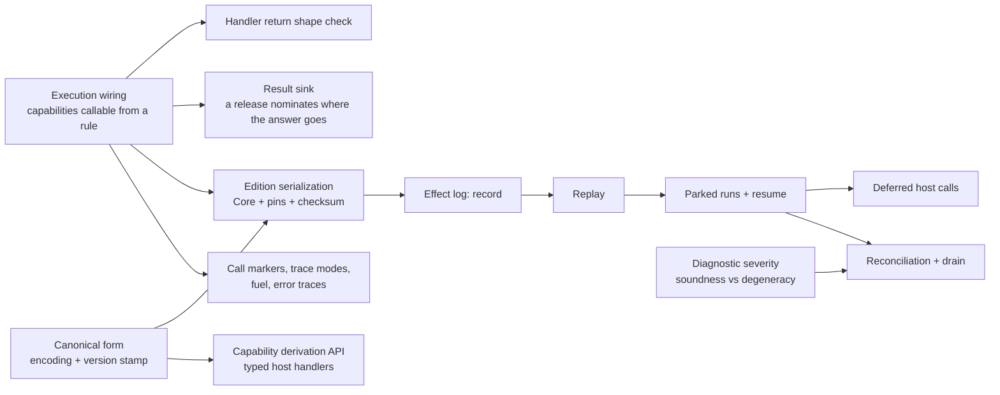

# Host Integration Roadmap

The shape of the work that makes [host-integration.md](./spec/host-integration.md) real, what
depends on what, and the scope of each piece — the source of truth for host-side work (the old
TODO.md is dissolved into it). The language roadmap — syntax, pattern matching, execution
features — is [roadmap.md](./roadmap.md).

## Done

Contracts as their own language, permanent `/N` revisions, numbered releases that decide what a
rule sees, and self-containment as the proof that projection is lossless. `EnvironmentContract`
checks rules with no handlers anywhere; `implement` binds handlers per `(name, revision)`. The CLI
checks and runs a rule against a release, and the library's public surface is narrowed to what a
host embeds.

## What is left

### Execution wiring

A rule that type-checks against a release still cannot run: nothing makes a capability callable,
and lowering has no binding for a name that arrives through projection. A release puts three kinds
of name in scope and each lowers differently — constructors become hoisted bindings producing
`MakeData`, capability calls become `HostCall`, and a capability value is a nullary `HostCall`
bound once at scope entry. Together they form the **edition prelude**: a Core scope tailored to one
edition, wrapping the rule's own scope. Compilation also emits the pin map beside the Core, so the
artifact is an `Edition` rather than a bare `CoreExpr`.

Designed and phased in [docs/design/callable-capabilities/](./design/callable-capabilities/) (PRD,
TDD, outline). The two decisions this section once left open are settled there as spec lines, not
ADRs: `HostCall` carries a plain name and no revision — the Core IR stays revision-free and the
revision lives in the pin map — and a capability used outside call position eta-expands to an
ordinary closure, so `f = creditScore` works with no new diagnostic. End state: `klein run` with
capabilities end to end, and the parked legacy `HostCallTest` gets its successor suite.

### Result sink

A release entry may nominate one capability as where the rule's answer goes — `result decide`, a
`fun` returning `Nothing` — so the host states what a rule must produce and a rule can decide
early. A rule either concludes on every path or its trailing expression is wrapped for it; mixing
the two is a compile error, not a silent wrap. Extracted from execution wiring because it is the
one slice that changes the contract language — §Releases today says a release entry names a
declaration and nothing else — so it goes spec-first: contracts.md and grammar.md, three new
contract checks, and an ADR for the real alternatives (implicit sink, trailing-expression-only,
allowing mixed conclusion). The design draft is in
[docs/design/callable-capabilities/tdd.md](./design/callable-capabilities/tdd.md); the phased file
list lives in that directory's git history. Depends on execution wiring for `compileRule` and the
runner.

### Handler return shape check

A handler answers with a `Value`, and nothing today checks it against the declared return type. A
shape check at resume turns a wrong answer into `handler creditCheck returned Str, declared Num`
rather than a failure deep in the machine. It rides along with execution wiring rather than
standing alone.

### Capability derivation API

Hosts write handlers as `(List<Value>) -> Value` today, so the Kotlin types and the Klein signature
can drift apart silently. Deriving Klein types from kotlinx.serialization descriptors — data class
to record, sealed to sum, nullable to `T?`, via `inline`/`reified` — makes that drift a compile
error, marshals both directions (Klein `Value` as a kotlinx serialization format), and emits the
checked-in contract file, mandatory for code-first. It wraps the dynamic host boundary rather than replacing
it, and is per-language work — the mapping and encoding spec it binds to is shared. The boundary
rules stay: no type variables, no function types.

### Canonical form + numeric spec

The written spec behind hashing and the wire: node tag plus fields in declared order, which fields
are semantic rather than trivia, and a version stamp on anything stored — so a mismatch means
discard and re-derive, never migrate, per the source-is-truth ADR. With no users, that stamp is
what keeps every representation decision reversible, including the open `Num` question: the
encoding commits to today's doubles knowingly, and exact rationals stay a later semantics change
paid for with a wipe. The `Long` round-trip rule — a host type may bind to `Num` only if every
value survives without silent loss — waits until a real host binds one. The value-identity rulings
replay needs (`-0.0` vs `0.0`, NaN canonicalization) belong to the pending evaluation spec, not
here.

### Edition serialization

An edition is what gets stored and run: compiled Core, the pin map, the source, and a version stamp
plus checksum per the source-is-truth ADR, round-trip tested. Spans need source provenance.
Direction: a CBOR-shaped tree encoding over the canonical form — storage encodes every field,
hashes walk only the semantic ones (spans, comment and whitespace trivia, and capability parameter
names excluded; the revision marker included), and the same encoding backs capability hashes and,
later, the FFI wire. Everything downstream queries it — replay needs something to replay
*against*, and reconciliation compares pins. Needs both the pins that execution wiring produces
and the encoding the canonical form defines.

### Effect log: record

The turn record and the append discipline, per the persist-the-log ADR: each completed
request/answer pair appended as a turn, with the pin-resolution record as entry one. Two invariants
settled while designing `Environment`: the log is **host-held and appended per turn**, never a
value extracted from a returned `Execution` — appends happen between `resume` and the next handler
invocation and must not be batched, so a handler throwing on turn 3 leaves turns 1–2 durably
recorded. And a **pending call is never stored** — the log holds completed pairs only, because
replay arrives back at the same suspension on its own. End state: every run through
`Environment.run` leaves a complete, inspectable log behind. Write-only — no replay, no parking.

### Replay

Rebuild a run from (edition + log): re-execute the machine feeding logged answers back in and
arrive at the same state — the final value, or the suspension after the last logged turn. Pure: a
function to a machine state, no API or lifecycle questions. End state: a determinism test — run
live, replay the log, identical outcome. Gated by the evaluation spec's value-identity rulings
(`-0.0`, NaN), which is where equality of logged answers becomes load-bearing.

### Parked runs + resume

The API shape deferred out of execution wiring: `run` grows a parked outcome (or a sibling entry
point), a parked run is an edition reference plus its log, and resuming is replay followed by
continuing with live handlers. End state: park mid-run, restart the process, resume to completion.

### Deferred host calls

Reinstate and drive `Implementation.Deferred` — commented out in Environment.kt since execution
wiring, because an unimplementable registration should not be writable: `deferred(name) { call -> }`
takes ownership and answers via `call.resume(v)` (in-process, any thread) or by persisting
`call.token` and answering from another process — the split is "answer inline" vs "I own the
continuation", not sync vs async. Handler errors stay unwrapped exceptions with no Klein-level
representation: the log is truth, so a failed turn simply did not happen, and the host retries or
abandons by its own policy (`call.fail(...)` is additive later if wanted). The
callable-capabilities outline records why this waits for the log: in-process, a blocking
`immediate` handler already covers it, and across a restart a closure is the wrong tool — replay
is the mechanism.

### Diagnostic severity

Every `TypeError` gets a class saying whether it is a soundness failure or a degeneracy, decided at
birth rather than mapped after the fact — per [diagnostic-severity.md](./ideas/diagnostic-severity.md).
Reconciliation needs it to tell an actionable recompile failure from noise. Includes splitting
`IncomparableEquality` out of `TypeMismatch` at the equality emission site.

### Reconciliation + drain

Pure functions and report objects over org-supplied data: reconcile with a pin-hash prefilter and
severity-classified reports, and answer drain queries — edition and parked-run counts per revision.
There is no retire flag; removal is optimistic, stranded runs alert, and a revision stays
restorable. Delivering failed-recompile reports to rule authors is the org's job, not the library's.

### Call markers, trace modes, error traces

Tail-call trace modes (full, budgeted, elided), fuel and metering per turn, runtime error traces,
and the CLI rendering for all of it. Nothing depends on it, so it lands whenever the machine's
observability starts to hurt. Tracked as the older issue #15.

## Loose ends

Small, unblocked, and easy to lose:

- **`CapabilityId` still hashes the signature.** The settled design is that identity is
  `(name, revision)` and the hash is only a change-detector for the reconciler. Worth fixing before
  reconciliation, which is what consumes it.
- **`klein-bench` is in no routine check** and silently stopped compiling for two phases.
- **The CLI exits 0 on usage errors** — unknown command, unknown option for a command. Matters as
  soon as `klein check` goes in a hook or a CI script.

## Out of scope for v1

- **Module system** — types already ride capability signatures; what modules would buy (shared
  Klein code, hub-type version bridging, module-mediated rule composition) is costed in the Module
  entry of host-integration.md.
- **Editor and storage connectors** — standalone components, after the library surface settles.
- **Non-JVM hosts via a C facade** — JVM languages (Java, Scala) consume the Kotlin library
  directly. Kotlin/Native can emit a dynamic or static library with a generated C header, but the
  real surface is a deliberate flat facade over the message layer: start / pending-request /
  resume / result / check, everything crossing as serialized bytes, one FFI call per turn — the
  coarse suspension boundary amortizes FFI cost by design. Guest languages use contract-first with
  per-language generated stubs. A standalone component per the library tenet, design-noted now so
  the derivation API's serialized forms are chosen knowing they become the FFI wire format. (WASM
  is the other eventual avenue; Kotlin/WASM-WASI is not mature yet.)
