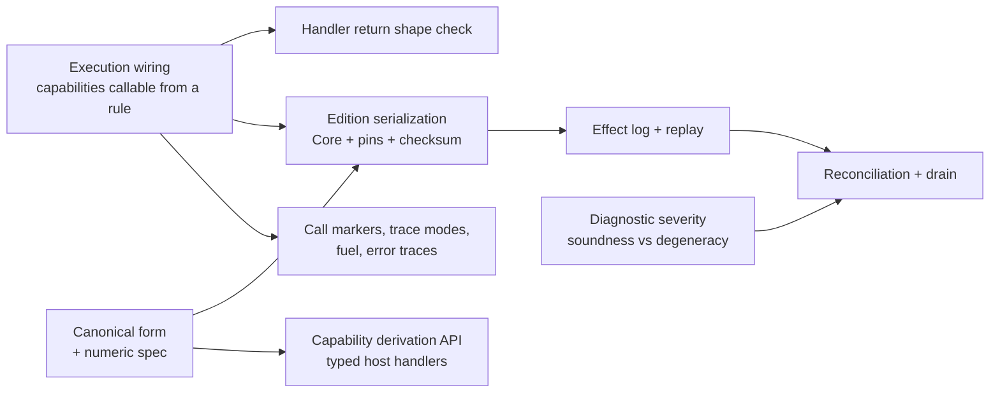

# Host Integration Roadmap

The shape of the work that makes [host-integration.md](./spec/host-integration.md) real, and what
depends on what. [TODO.md](../TODO.md) is the detail and the source of truth for scope; this is the
map. The language roadmap — syntax, pattern matching, execution features — is
[roadmap.md](./roadmap.md).

## Done

Contracts as their own language, permanent `/N` revisions, numbered releases that decide what a
rule sees, and self-containment as the proof that projection is lossless. `EnvironmentContract`
checks rules with no handlers anywhere; `implement` binds handlers per `(name, revision)`. The CLI
checks and runs a rule against a release, and the library's public surface is narrowed to what a
host embeds.

## What is left

### Execution wiring

A rule that type-checks against a release still cannot run: nothing makes a capability callable,
and lowering has no binding for a name that arrives through projection. A release puts three kinds
of name in scope and each lowers differently — constructors become hoisted bindings producing
`MakeData`, capability calls become `HostCall`, and capability values are linked by the machine
before the program starts. Lowering also begins emitting the pin set, so `lower` stops returning a
bare `CoreExpr`.

Two decisions are open. `HostCall` carries a plain name and no revision, which keeps the Core IR
revision-free and puts the revision in the pin set — worth keeping, and worth stating. And a
capability used outside call position (`f = creditScore`) either eta-expands or becomes a checker
error, which changes whether a new diagnostic is needed.

### Handler return shape check

A handler answers with a `Value`, and nothing today checks it against the declared return type. A
shape check at resume turns a wrong answer into `handler creditCheck returned Str, declared Num`
rather than a failure deep in the machine. It rides along with execution wiring rather than
standing alone.

### Capability derivation API

Hosts write handlers as `(List<Value>) -> Value` today, so the Kotlin types and the Klein signature
can drift apart silently. Deriving Klein types from kotlinx.serialization descriptors — data class
to record, sealed to sum, nullable to `T?` — makes that drift a compile error, and emits the
checked-in contract file. The boundary rules stay: no type variables, no function types.

### Canonical form + numeric spec

The written spec behind hashing and the wire: node tag plus fields in declared order, and which
fields are semantic rather than trivia. It also fixes the numeric contract — a host type may bind
to `Num` only if every value round-trips without silent loss, which Kotlin `Long` fails today. It
is entangled with the open `Num` question, since exact rationals would change what binds.

### Edition serialization

An edition is what gets stored and run: compiled Core, the pin set, the source, and a version stamp
plus checksum per the source-is-truth ADR. Everything downstream queries it — replay needs
something to replay *against*, and reconciliation compares pins. Needs both the pins that execution
wiring produces and the encoding the canonical form defines.

### Effect log + replay

The persistence model, per the persist-the-log ADR: record each turn as a completed request/answer
pair, replay a log against an edition to rebuild a parked run, resume from there. Two invariants
are already settled — the log is host-held and appended per turn, never extracted from a returned
`Execution`, and a pending call is never stored because replay arrives back at the same suspension.
Parked runs, drain counts and migration tooling all stand on this.

### Diagnostic severity

Every `TypeError` gets a class saying whether it is a soundness failure or a degeneracy, decided at
birth rather than mapped after the fact. Reconciliation needs it to tell an actionable recompile
failure from noise. Includes splitting `IncomparableEquality` out of `TypeMismatch` at the equality
emission site.

### Reconciliation + drain

Pure functions and report objects over org-supplied data: reconcile with a pin-hash prefilter and
severity-classified reports, and answer drain queries — edition and parked-run counts per revision.
There is no retire flag; removal is optimistic, stranded runs alert, and a revision stays
restorable. Delivering failed-recompile reports to rule authors is the org's job, not the library's.

### Call markers, trace modes, error traces

Tail-call trace modes (full, budgeted, elided), fuel and metering per turn, runtime error traces,
and the CLI rendering for all of it. Nothing depends on it, so it lands whenever the machine's
observability starts to hurt. Tracked as the older issue #15.

## Loose ends

Small, unblocked, and easy to lose:

- **`CapabilityId` still hashes the signature.** The settled design is that identity is
  `(name, revision)` and the hash is only a change-detector for the reconciler. Worth fixing before
  reconciliation, which is what consumes it.
- **`klein-bench` is in no routine check** and silently stopped compiling for two phases.
- **The CLI exits 0 on usage errors** — unknown command, unknown option for a command. Matters as
  soon as `klein check` goes in a hook or a CI script.

## Out of scope for v1

Modules, editor and storage connectors, and non-JVM hosts via a C facade. See TODO.md for why each,
and for what the facade's existence implies about choosing the derivation API's serialized forms
now.
