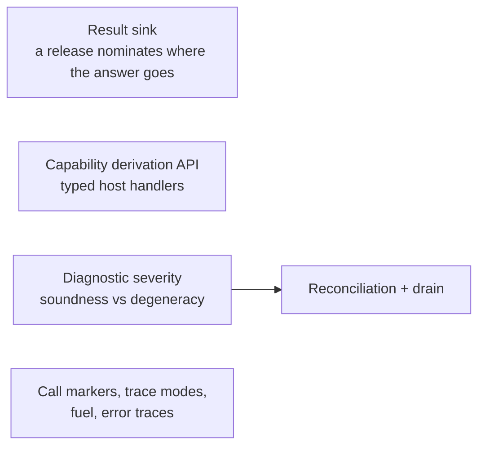

# Host Integration Roadmap

The shape of the work that makes [host-integration.md](./spec/host-integration.md) real, what
depends on what, and the scope of each piece — the source of truth for host-side work (the old
TODO.md is dissolved into it). The language roadmap — syntax, pattern matching, execution
features — is [roadmap.md](./roadmap.md).

## Done

Contracts as their own language, permanent `/N` revisions, numbered releases that decide what a
rule sees, and self-containment as the proof that projection is lossless. `EnvironmentContract`
checks rules with no handlers anywhere; `implement` binds handlers per `(name, revision)`. The CLI
checks and runs a rule against a release, and the library's public surface is narrowed to what a
host embeds.

**Execution wiring.** A release puts three kinds of name in scope and each lowers differently —
constructors become hoisted bindings producing `MakeData`, capability calls become `HostCall`, and
a capability value is a nullary `HostCall` bound once at scope entry. Together they form the
**edition prelude**: a Core scope tailored to one edition, wrapping the rule's own scope.
`compileRule` emits the pin map beside the Core, so the artifact is an `Edition` rather than a bare
`CoreExpr`, and `Environment.run` checks every pin against the registered implementations before
the machine starts, then drives the suspend/resume loop to a value, checking each handler answer
against the declared type at the resume boundary. The observable rules are in
spec/host-integration.md (§Capability, §Edition, §Run); the decisions and rejected alternatives are
in the ADR
[capabilities-execute-through-the-suspension-path](./decisions/2026-08-24-capabilities-execute-through-the-suspension-path.md).
Two hosts prove it: `klein run` prompts for each capability call, and `klein-example-host` — a
Gradle module outside `klein-lib`, so `internal` is invisible to it — boot-registers `creditScore`,
marks `customer` as run-supplied, and compiles against the public surface only.

**The effect log and the unified run.** Every run returns its full history as a value: the inputs
read at the start, every call with its answer, and how the run ended. A malformed history cannot
even be represented. One run operation covers starting fresh, resuming, and replaying; replay
matches the log by position, asks the host nothing, and treats a recorded ending as a check, never
something to rewrite. A rule failing is a normal outcome, a host misusing the run is an error, and
a host's own exceptions pass through untouched. Hosts persist entries as they are recorded, inside
their own transaction, and a parked run resumes by appending the answer to its log. Logs
round-trip through a binary and a JSON encoding, both version-stamped. The rules are in
[spec/effect-log.md](./spec/effect-log.md); the decision record is
[replay-is-ordinal-migration-is-host-policy](./decisions/2026-08-26-replay-is-ordinal-migration-is-host-policy.md).

**Editions at rest.** An edition is stored as an immutable artifact: its source and language
version, its pins, its Core as an opaque blob carrying the compiler version, and a checksum over
the whole. To load a stored edition, the host decodes it against the contract and gets one of
two things: the edition, when the artifact is intact; or the recorded inputs with a reason the stored Core
cannot be used (the checksum does not match, the compiler changed, or a pinned declaration was
removed or edited in place). In the second case the host compiles the recorded inputs again with
`compileRule(source, pins)`. Compiling against a release turns the release into its pin map and
makes the same call. An edition pins every type and capability its source reaches, never a
constructor, and each pin carries a hash of its declaration. Re-derivation goes through the
pins, never a release, so removing a release touches nothing already compiled. An edition
carries the surface its pins resolve to, built once when it is compiled or decoded; a run reads
it and never resolves pins, and the contract keeps no memo of resolved pin sets (each release
keeps one lazily built surface, which is thread-safe). Along the way handler registrations
became values and the registry immutable, and the pin check moved to the one step that
resolves pins, shared by compiling and decoding. The rules
are in [spec/edition.md](./spec/edition.md). Two notes for later features: the artifact must
capture everything a release contributes to compilation (the result sink is the first feature
that will test that), and the checksum needs only a deterministic walk, not a canonical form, so
the canonical-form dissolution below stands.

**One error architecture.** Two kinds of error, split by what they are about. A `Diagnostic` is
about a document and has a span; checking or compiling returns it in a `Checked`, and a failed run
carries it in its outcome and its log. A `HostError` is about the environment and has no span; it
is only ever thrown, inside the one public `KleinException`, one error per fault with its fields
kept. A contract that does not check is a host error carrying the contract's diagnostics. The
lexer, parser and machine unwind with internal exceptions that never cross a public function. The
rules are in spec/host-integration.md (§Errors).

## What is left

### Result sink

A release entry may nominate one capability as where the rule's answer goes — `result decide`, a
`fun` returning `Nothing` — so the host states what a rule must produce and a rule can decide
early. A rule either concludes on every path or its trailing expression is wrapped for it; mixing
the two is a compile error, not a silent wrap. Extracted from execution wiring because it is the
one slice that changes the contract language — §Releases today says a release entry names a
declaration and nothing else — so it goes spec-first: contracts.md and grammar.md, three new
contract checks, and an ADR for the real alternatives (implicit sink, trailing-expression-only,
allowing mixed conclusion). One constraint from edition serialization: whatever the sink
contributes to compilation must land in the edition's stored form (a pin or a field), or
pin-based re-derivation silently reproduces the wrong program. The design draft is in
[ideas/result-sink.md](./ideas/result-sink.md). Builds on `compileRule` and the runner.

### Capability derivation API

Hosts write handlers as `(List<Value>) -> Value` today, so the Kotlin types and the Klein signature
can drift apart silently. Deriving Klein types from kotlinx.serialization descriptors — data class
to record, sealed to sum, nullable to `T?`, via `inline`/`reified` — makes that drift a compile
error, marshals both directions (Klein `Value` as a kotlinx serialization format), and emits the
checked-in contract file, mandatory for code-first. It wraps the dynamic host boundary rather than replacing
it, and is per-language work — the mapping and encoding spec it binds to is shared. The boundary
rules stay: no type variables, no function types. It also carries the enforcement of contracts.md
§"The host sees exactly the declared shape": marshalling is narrowing, so extra record fields stop
crossing when values decode into host types — and whether the raw `List<Value>` seam narrows too
is decided here.

### Hashing and the numeric commitments (dissolved as a v1 item)

Canonical form is no longer a deliverable. The value encoding already exists — the effect log's
binary codec is version-stamped and deterministic — and canonical bytes (equal values encode to
equal bytes) have no consumer: replay compares decoded values in memory, and nothing
content-addresses anything. Where a hash is needed, a deterministic walk of the data suffices;
the edition checksum and the pin hash are both computed that way, as
[spec/edition.md](./spec/edition.md) specifies.

The numeric commitments stand on their own: encodings commit to today's doubles knowingly, and
exact rationals stay a later semantics change paid for with a wipe — the version stamp on
anything stored keeps that reversible. The `Long` round-trip rule — a host type may bind to
`Num` only if every value survives without silent loss — waits until a real host binds one. The
value-identity rulings replay needs (`-0.0` vs `0.0`, NaN canonicalization) belong to the
pending evaluation spec.

### Diagnostic severity

Every `TypeError` gets a class saying whether it is a soundness failure or a degeneracy, decided at
birth rather than mapped after the fact — per [diagnostic-severity.md](./ideas/diagnostic-severity.md).
Reconciliation needs it to tell an actionable recompile failure from noise. Includes splitting
`IncomparableEquality` out of `TypeMismatch` at the equality emission site.

### Reconciliation + drain

Pure functions and report objects over org-supplied data: the v1 reconciler recompiles every
edition against the edited contract and reports with severity-classified diagnostics, and answers
drain queries — edition and parked-run counts per revision. There is no retire flag; removal is
optimistic, stranded runs alert, and a revision stays restorable. Delivering failed-recompile
reports to rule authors is the org's job, not the library's.

The change detector already exists: every pin carries the hash of its declaration, so
the reconciler compares each edition's pins with the contract's declarations and recompiles only
the editions where one differs.

### Call markers, trace modes, error traces

Tail-call trace modes (full, budgeted, elided), fuel and metering per turn, runtime error traces,
and the CLI rendering for all of it. Nothing depends on it, so it lands whenever the machine's
observability starts to hurt. Tracked as the older issue #15.

## Loose ends

Small, unblocked, and easy to lose:

- **An edition does not know which environment it belongs to.** Two environments in one
  process may declare the same names, and an edition compiled under one and run under the other
  is refused only when the revisions differ. An environment identity, recorded in the edition
  and checked at the run's pre-flight, closes that; the pin hashes are not compared at run time
  by decision.
- **`klein-bench` is in no routine check** and silently stopped compiling for two phases.
- **The CLI exits 0 on usage errors** — unknown command, unknown option for a command. Matters as
  soon as `klein check` goes in a hook or a CI script.

## Out of scope for v1

- **Module system** — types already ride capability signatures; what modules would buy (shared
  Klein code, hub-type version bridging, module-mediated rule composition) is costed in the Module
  entry of host-integration.md.
- **Storage connectors** — standalone components, after the library surface settles. (The editor
  and the migration toolkit live on the global roadmap, [roadmap.md](./roadmap.md), as features of
  their own.)
- **Non-JVM hosts via a C facade** — JVM languages (Java, Scala) consume the Kotlin library
  directly. Kotlin/Native can emit a dynamic or static library with a generated C header, but the
  real surface is a deliberate flat facade over the message layer: start / pending-request /
  resume / result / check, everything crossing as serialized bytes, one FFI call per turn — the
  coarse suspension boundary amortizes FFI cost by design. Guest languages use contract-first with
  per-language generated stubs. A standalone component per the library tenet, design-noted now so
  the derivation API's serialized forms are chosen knowing they become the FFI wire format. (WASM
  is the other eventual avenue; Kotlin/WASM-WASI is not mature yet.)
