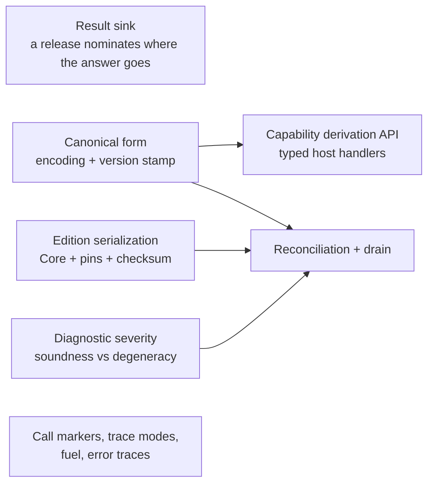

# Host Integration Roadmap

The shape of the work that makes [host-integration.md](./spec/host-integration.md) real, what
depends on what, and the scope of each piece — the source of truth for host-side work (the old
TODO.md is dissolved into it). The language roadmap — syntax, pattern matching, execution
features — is [roadmap.md](./roadmap.md).

## Done

Contracts as their own language, permanent `/N` revisions, numbered releases that decide what a
rule sees, and self-containment as the proof that projection is lossless. `EnvironmentContract`
checks rules with no handlers anywhere; `implement` binds handlers per `(name, revision)`. The CLI
checks and runs a rule against a release, and the library's public surface is narrowed to what a
host embeds.

**Execution wiring.** A release puts three kinds of name in scope and each lowers differently —
constructors become hoisted bindings producing `MakeData`, capability calls become `HostCall`, and
a capability value is a nullary `HostCall` bound once at scope entry. Together they form the
**edition prelude**: a Core scope tailored to one edition, wrapping the rule's own scope.
`compileRule` emits the pin map beside the Core, so the artifact is an `Edition` rather than a bare
`CoreExpr`, and `Environment.run` checks every pin against the registered implementations before
the machine starts, then drives the suspend/resume loop to a value, checking each handler answer
against the declared type at the resume boundary. The observable rules are in
spec/host-integration.md (§Capability, §Edition, §Run); the decisions and rejected alternatives are
in the ADR
[capabilities-execute-through-the-suspension-path](./decisions/2026-08-24-capabilities-execute-through-the-suspension-path.md).
Two hosts prove it: `klein run` prompts for each capability call, and `klein-example-host` — a
Gradle module outside `klein-lib`, so `internal` is invisible to it — boot-registers `creditScore`,
marks `customer` as run-supplied, and compiles against the public surface only.

**The effect log and the unified run.** Every run returns its full history as a value: the inputs
read at the start, every call with its answer, and how the run ended. A malformed history cannot
even be represented. One run operation covers starting fresh, resuming, and replaying; replay
matches the log by position, asks the host nothing, and treats a recorded ending as a check, never
something to rewrite. A rule failing is a normal outcome, a host misusing the run is an error, and
a host's own exceptions pass through untouched. Hosts persist entries as they are recorded, inside
their own transaction, and a parked run resumes by appending the answer to its log. Logs
round-trip through a binary and a JSON encoding, both version-stamped. The rules are in
[spec/effect-log.md](./spec/effect-log.md); the decision record is
[replay-is-ordinal-migration-is-host-policy](./decisions/2026-08-26-replay-is-ordinal-migration-is-host-policy.md).

## What is left

### Result sink

A release entry may nominate one capability as where the rule's answer goes — `result decide`, a
`fun` returning `Nothing` — so the host states what a rule must produce and a rule can decide
early. A rule either concludes on every path or its trailing expression is wrapped for it; mixing
the two is a compile error, not a silent wrap. Extracted from execution wiring because it is the
one slice that changes the contract language — §Releases today says a release entry names a
declaration and nothing else — so it goes spec-first: contracts.md and grammar.md, three new
contract checks, and an ADR for the real alternatives (implicit sink, trailing-expression-only,
allowing mixed conclusion). The design draft is in
[ideas/result-sink.md](./ideas/result-sink.md). Builds on `compileRule` and the runner.

### Capability derivation API

Hosts write handlers as `(List<Value>) -> Value` today, so the Kotlin types and the Klein signature
can drift apart silently. Deriving Klein types from kotlinx.serialization descriptors — data class
to record, sealed to sum, nullable to `T?`, via `inline`/`reified` — makes that drift a compile
error, marshals both directions (Klein `Value` as a kotlinx serialization format), and emits the
checked-in contract file, mandatory for code-first. It wraps the dynamic host boundary rather than replacing
it, and is per-language work — the mapping and encoding spec it binds to is shared. The boundary
rules stay: no type variables, no function types. It also carries the enforcement of contracts.md
§"The host sees exactly the declared shape": marshalling is narrowing, so extra record fields stop
crossing when values decode into host types — and whether the raw `List<Value>` seam narrows too
is decided here.

### Canonical form + numeric spec

A late item now: canonicalization's only consumers are hashing and byte-comparison, and every use
of hashing here is an optimization with a correct slow path (the reconciliation prefilter falls
back to recompile-everything; the stored-Core checksum fell away with the Core encoding itself).
It lands when the fleet is big enough that the slow paths hurt — feeding the reconciler's
prefilter and, eventually, the FFI wire. The version stamp on anything stored is what keeps every
representation decision reversible until then, including the open `Num` question: encodings commit
to today's doubles knowingly, and exact rationals stay a later semantics change paid for with a
wipe. The `Long` round-trip rule — a host type may bind to `Num` only if every value survives
without silent loss — waits until a real host binds one. The value-identity rulings replay needs
(`-0.0` vs `0.0`, NaN canonicalization) belong to the pending evaluation spec, not here.

### Edition serialization

An edition's stored form is **source + release number + pin map**, version-stamped: per the
source-is-truth ADR the Core is a cache, so loading an edition re-derives it rather than decoding
it, and a stamp mismatch means discard and re-derive, never migrate. Three flat fields, a trivial
encoding — no Core tree encoding exists in v1, which is what dissolved the dependency on canonical
form. Stored pins diverging from a fresh re-derivation is not a storage fault; it is exactly the
signal reconciliation exists to act on. Replay is the consumer that forces this item: it needs
something durable to replay *against*. The optional stored-Core cache earns a second job here:
re-deriving Core requires the contract to still resolve the edition's release, so replaying the
history of an edition whose release has been retired needs the cache.

### Diagnostic severity

Every `TypeError` gets a class saying whether it is a soundness failure or a degeneracy, decided at
birth rather than mapped after the fact — per [diagnostic-severity.md](./ideas/diagnostic-severity.md).
Reonciliation needs it to tell an actionable recompile failure from noise. Includes splitting
`IncomparableEquality` out of `TypeMismatch` at the equality emission site.

### Reconciliation + drain

Pure functions and report objects over org-supplied data: reconcile with a pin-hash prefilter and
severity-classified reports, and answer drain queries — edition and parked-run counts per revision.
There is no retire flag; removal is optimistic, stranded runs alert, and a revision stays
restorable. Delivering failed-recompile reports to rule authors is the org's job, not the library's.

### Call markers, trace modes, error traces

Tail-call trace modes (full, budgeted, elided), fuel and metering per turn, runtime error traces,
and the CLI rendering for all of it. Nothing depends on it, so it lands whenever the machine's
observability starts to hurt. Tracked as the older issue #15.

## Loose ends

Small, unblocked, and easy to lose:

- **`CapabilityId` still hashes the signature.** The settled design is that identity is
  `(name, revision)` and the hash is only a change-detector for the reconciler. Worth fixing before
  reconciliation, which is what consumes it.
- **`klein-bench` is in no routine check** and silently stopped compiling for two phases.
- **The release-resolution memo is not thread-safe**, and `run` now touches it on every call
  (pre-flight resolves the release twice, the run once). Two threads running editions against one
  shared `Environment` race on a plain mutable map. Needs a multiplatform locking decision; until
  then an `Environment` is single-threaded.
- **The CLI exits 0 on usage errors** — unknown command, unknown option for a command. Matters as
  soon as `klein check` goes in a hook or a CI script.

## Out of scope for v1

- **Module system** — types already ride capability signatures; what modules would buy (shared
  Klein code, hub-type version bridging, module-mediated rule composition) is costed in the Module
  entry of host-integration.md.
- **Storage connectors** — standalone components, after the library surface settles. (The editor
  and the migration toolkit live on the global roadmap, [roadmap.md](./roadmap.md), as features of
  their own.)
- **Non-JVM hosts via a C facade** — JVM languages (Java, Scala) consume the Kotlin library
  directly. Kotlin/Native can emit a dynamic or static library with a generated C header, but the
  real surface is a deliberate flat facade over the message layer: start / pending-request /
  resume / result / check, everything crossing as serialized bytes, one FFI call per turn — the
  coarse suspension boundary amortizes FFI cost by design. Guest languages use contract-first with
  per-language generated stubs. A standalone component per the library tenet, design-noted now so
  the derivation API's serialized forms are chosen knowing they become the FFI wire format. (WASM
  is the other eventual avenue; Kotlin/WASM-WASI is not mature yet.)
